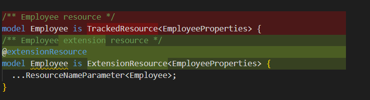
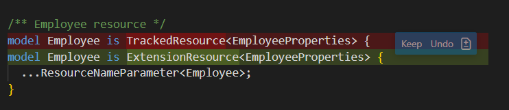
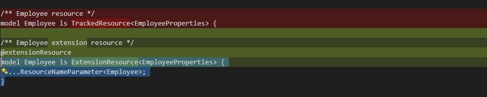

# Plain Agent

## Claude Sonnet 4.5

### Output

```tsp
/** Contoso API versions */
enum Versions {
  /** 2021-10-01-preview version */
  // @useDependency(Azure.ResourceManager.Versions.v1_0_Preview_1)
  @armCommonTypesVersion(Azure.ResourceManager.CommonTypes.Versions.v5)
  `2021-10-01-preview`,

  /** 2021-10-01-preview version */
  // @useDependency(Azure.ResourceManager.Versions.v1_0_Preview_1)
  @armCommonTypesVersion(Azure.ResourceManager.CommonTypes.Versions.v5)
  `2024-10-01-preview`,

  /** 2025-05-04-preview version */
  // @useDependency(Azure.ResourceManager.Versions.v1_0_Preview_1)
  @armCommonTypesVersion(Azure.ResourceManager.CommonTypes.Versions.v5)
  `2025-05-04-preview`,
}

/** Employee resource */
model Employee is ExtensionResource<EmployeeProperties> {
  ...ResourceNameParameter<Employee>;
}

/** Employee properties */
model EmployeeProperties {
  /** Age of employee */
  age?: int32;

  /** City of employee */
  city?: string;

  /** Profile of employee */
  @encode("base64url")
  profile?: bytes;

  /** The status of the last operation. */
  @visibility(Lifecycle.Read)
  provisioningState?: ProvisioningState;
}

/** The resource provisioning state. */
@lroStatus
union ProvisioningState {
  ResourceProvisioningState,

  /** The resource is being provisioned */
  Provisioning: "Provisioning",

  /** The resource is updating */
  Updating: "Updating",

  /** The resource is being deleted */
  Deleting: "Deleting",

  /** The resource create request has been accepted */
  Accepted: "Accepted",

  string,
}

@armResourceOperations
interface Employees {
  get is ArmResourceRead<Employee>;
  createOrUpdate is ArmResourceCreateOrReplaceAsync<Employee>;
  update is ArmResourcePatchSync<Employee, EmployeeProperties>;
  delete is ArmResourceDeleteWithoutOkAsync<Employee>;
  listByParent is ArmResourceListByParent<Employee>;
}

```


### Result

fail

## GPT-4.1

### Output

```tsp
/** Contoso API versions */
enum Versions {
  /** 2021-10-01-preview version */
  // @useDependency(Azure.ResourceManager.Versions.v1_0_Preview_1)
  @armCommonTypesVersion(Azure.ResourceManager.CommonTypes.Versions.v5)
  `2021-10-01-preview`,

  /** 2021-10-01-preview version */
  // @useDependency(Azure.ResourceManager.Versions.v1_0_Preview_1)
  @armCommonTypesVersion(Azure.ResourceManager.CommonTypes.Versions.v5)
  `2024-10-01-preview`,

  /** 2025-05-04-preview version */
  // @useDependency(Azure.ResourceManager.Versions.v1_0_Preview_1)
  @armCommonTypesVersion(Azure.ResourceManager.CommonTypes.Versions.v5)
  `2025-05-04-preview`,
}

/** Employee extension resource */
@extensionResource
model Employee is ExtensionResource<EmployeeProperties> {
  ...ResourceNameParameter<Employee>;
}

/** Employee properties */
model EmployeeProperties {
  /** Age of employee */
  age?: int32;

  /** City of employee */
  city?: string;

  /** Profile of employee */
  @encode("base64url")
  profile?: bytes;

  /** The status of the last operation. */
  @visibility(Lifecycle.Read)
  provisioningState?: ProvisioningState;
}

/** The resource provisioning state. */
@lroStatus
union ProvisioningState {
  ResourceProvisioningState,

  /** The resource is being provisioned */
  Provisioning: "Provisioning",

  /** The resource is updating */
  Updating: "Updating",

  /** The resource is being deleted */
  Deleting: "Deleting",

  /** The resource create request has been accepted */
  Accepted: "Accepted",

  string,
}

@armResourceOperations
interface Employees {
  get is ArmResourceRead<Employee>;
  createOrUpdate is ArmResourceCreateOrReplaceAsync<Employee>;
  update is ArmResourcePatchSync<Employee, EmployeeProperties>;
  delete is ArmResourceDeleteWithoutOkAsync<Employee>;
  listByResourceGroup is ArmResourceListByParent<Employee>;
  listBySubscription is ArmListBySubscription<Employee>;
}

```



### Result

fail

# Agent with Authoring Tool

## Claude Sonnet 4.5

### Output

```tsp
/** Contoso API versions */
enum Versions {
  /** 2021-10-01-preview version */
  // @useDependency(Azure.ResourceManager.Versions.v1_0_Preview_1)
  @armCommonTypesVersion(Azure.ResourceManager.CommonTypes.Versions.v5)
  `2021-10-01-preview`,

  /** 2021-10-01-preview version */
  // @useDependency(Azure.ResourceManager.Versions.v1_0_Preview_1)
  @armCommonTypesVersion(Azure.ResourceManager.CommonTypes.Versions.v5)
  `2024-10-01-preview`,

  /** 2025-05-04-preview version */
  // @useDependency(Azure.ResourceManager.Versions.v1_0_Preview_1)
  @armCommonTypesVersion(Azure.ResourceManager.CommonTypes.Versions.v5)
  `2025-05-04-preview`,
}

/** Employee resource */
model Employee is ExtensionResource<EmployeeProperties> {
  ...ResourceNameParameter<Employee>;
}

/** Employee properties */
model EmployeeProperties {
  /** Age of employee */
  age?: int32;

  /** City of employee */
  city?: string;

  /** Profile of employee */
  @encode("base64url")
  profile?: bytes;

  /** The status of the last operation. */
  @visibility(Lifecycle.Read)
  provisioningState?: ProvisioningState;
}

/** The resource provisioning state. */
@lroStatus
union ProvisioningState {
  ResourceProvisioningState,

  /** The resource is being provisioned */
  Provisioning: "Provisioning",

  /** The resource is updating */
  Updating: "Updating",

  /** The resource is being deleted */
  Deleting: "Deleting",

  /** The resource create request has been accepted */
  Accepted: "Accepted",

  string,
}

@armResourceOperations
interface Employees {
  get is ArmResourceRead<Employee>;
  createOrUpdate is ArmResourceCreateOrReplaceAsync<Employee>;
  update is ArmResourcePatchSync<Employee, EmployeeProperties>;
  delete is ArmResourceDeleteWithoutOkAsync<Employee>;
  listByResourceGroup is ArmResourceListByParent<Employee>;
  listBySubscription is ArmListBySubscription<Employee>;
}

```



### Result

fail

## GPT 4.1

### Output

```tsp
/** Contoso API versions */
enum Versions {
  /** 2021-10-01-preview version */
  // @useDependency(Azure.ResourceManager.Versions.v1_0_Preview_1)
  @armCommonTypesVersion(Azure.ResourceManager.CommonTypes.Versions.v5)
  `2021-10-01-preview`,

  /** 2021-10-01-preview version */
  // @useDependency(Azure.ResourceManager.Versions.v1_0_Preview_1)
  @armCommonTypesVersion(Azure.ResourceManager.CommonTypes.Versions.v5)
  `2024-10-01-preview`,

  /** 2025-05-04-preview version */
  // @useDependency(Azure.ResourceManager.Versions.v1_0_Preview_1)
  @armCommonTypesVersion(Azure.ResourceManager.CommonTypes.Versions.v5)
  `2025-05-04-preview`,
}

/** Employee resource */
model Employee is ExtensionResource<EmployeeProperties> {
  ...ResourceNameParameter<Employee>;
}

/** Employee properties */
model EmployeeProperties {
  /** Age of employee */
  age?: int32;

  /** City of employee */
  city?: string;

  /** Profile of employee */
  @encode("base64url")
  profile?: bytes;

  /** The status of the last operation. */
  @visibility(Lifecycle.Read)
  provisioningState?: ProvisioningState;
}

/** The resource provisioning state. */
@lroStatus
union ProvisioningState {
  ResourceProvisioningState,

  /** The resource is being provisioned */
  Provisioning: "Provisioning",

  /** The resource is updating */
  Updating: "Updating",

  /** The resource is being deleted */
  Deleting: "Deleting",

  /** The resource create request has been accepted */
  Accepted: "Accepted",

  string,
}

@armResourceOperations
interface Employees {
  get is ArmResourceRead<Employee>;
  createOrUpdate is ArmResourceCreateOrReplaceAsync<Employee>;
  update is ArmResourcePatchSync<Employee, EmployeeProperties>;
  delete is ArmResourceDeleteWithoutOkAsync<Employee>;
  listByResourceGroup is ArmResourceListByParent<Employee>;
  listBySubscription is ArmListBySubscription<Employee>;
}


```


### Result

fail
