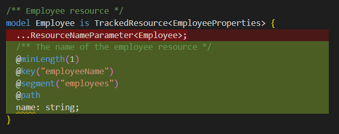
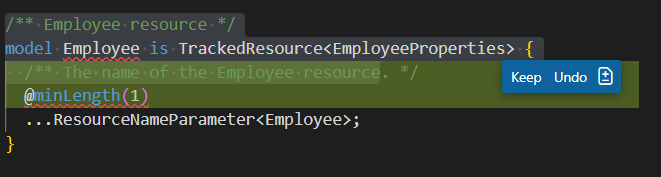
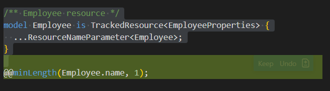

# Plain Agent

## Claude Sonnet 4.5

### Output

```tsp
/** Employee resource */
model Employee is TrackedResource<EmployeeProperties> {
  /** The name of the employee resource */
  @minLength(1)
  @key("employeeName")
  @segment("employees")
  @path
  name: string;
}

```



### Result

fail

missing the pattern decorator

## GPT-4.1

### Output

```tsp
/** Employee resource */
model Employee is TrackedResource<EmployeeProperties> {
  /** The name of the Employee resource. */
  @minLength(1)
  ...ResourceNameParameter<Employee>;
}

```

### Result

failed

cannot apply decorator on spread model

# Agent with Authoring Tool

## Claude Sonnet 4.5

### Output

```tsp
/** Employee resource */
model Employee is TrackedResource<EmployeeProperties> {
  ...ResourceNameParameter<Employee>;
}

@@minLength(Employee.name, 1);

```


### Result

fail

actually, the resource key name is changed to 'employeeName', the @@minLength(Employee.name, 1); does not take effect.
## GPT 4.1

### Output

```tsp
/** Employee resource */
model Employee is TrackedResource<EmployeeProperties> {
  ...ResourceNameParameter<Employee>;
}

@@minLength(Employee.name, 1);


```


### Result

fail

actually, the resource key name is changed to 'employeeName', the @@minLength(Employee.name, 1); does not take effect.
