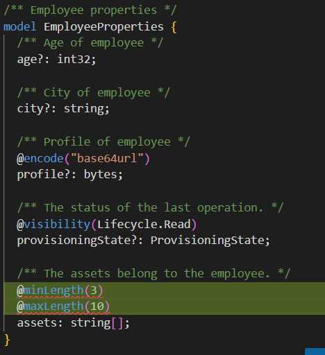
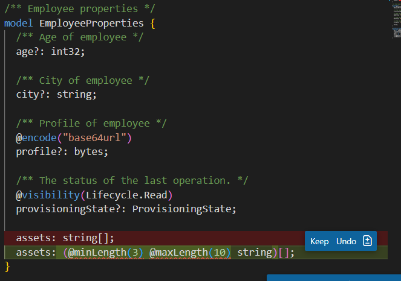
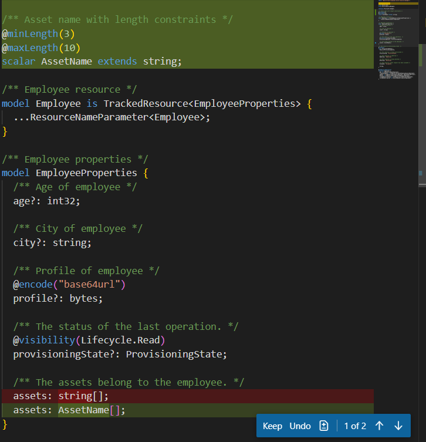
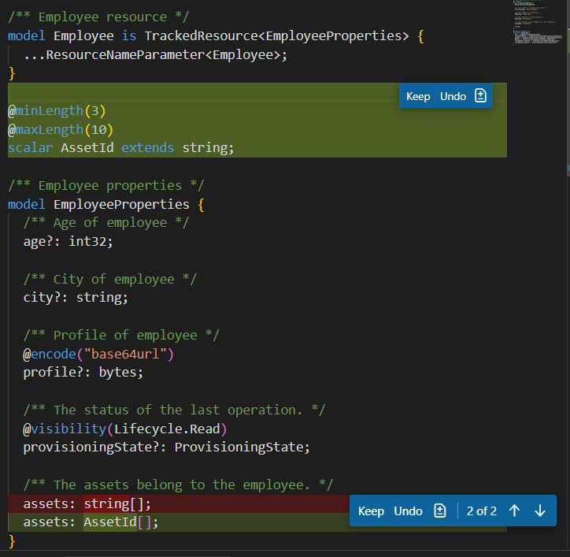

# Plain Agent

## Claude Sonnet 4.5

### Output

```tsp
/** Employee properties */
model EmployeeProperties {
  /** Age of employee */
  age?: int32;

  /** City of employee */
  city?: string;

  /** Profile of employee */
  @encode("base64url")
  profile?: bytes;

  /** The status of the last operation. */
  @visibility(Lifecycle.Read)
  provisioningState?: ProvisioningState;

  /** The assets belong to the employee. */
  @minLength(3)
  @maxLength(10)
  assets: string[];
}

```


### Result

fail

minLength and maxLength only can apply on string

## GPT-4.1

### Output

```tsp
/** Employee properties */
model EmployeeProperties {
  /** Age of employee */
  age?: int32;

  /** City of employee */
  city?: string;

  /** Profile of employee */
  @encode("base64url")
  profile?: bytes;

  /** The status of the last operation. */
  @visibility(Lifecycle.Read)
  provisioningState?: ProvisioningState;

  assets: (@minLength(3) @maxLength(10) string)[];
}

```


### Result

failed

cannot apply decorator on expression

# Agent with Authoring Tool

## Claude Sonnet 4.5

### Output

```tsp
/** Asset name with length constraints */
@minLength(3)
@maxLength(10)
scalar AssetName extends string;

/** Employee resource */
model Employee is TrackedResource<EmployeeProperties> {
  ...ResourceNameParameter<Employee>;
}

/** Employee properties */
model EmployeeProperties {
  /** Age of employee */
  age?: int32;

  /** City of employee */
  city?: string;

  /** Profile of employee */
  @encode("base64url")
  profile?: bytes;

  /** The status of the last operation. */
  @visibility(Lifecycle.Read)
  provisioningState?: ProvisioningState;

  /** The assets belong to the employee. */
  assets: AssetName[];
}

```


### Result

pass

## GPT 4.1

### Output

```tsp
@minLength(3)
@maxLength(10)
scalar AssetId extends string;

/** Employee properties */
model EmployeeProperties {
  /** Age of employee */
  age?: int32;

  /** City of employee */
  city?: string;

  /** Profile of employee */
  @encode("base64url")
  profile?: bytes;

  /** The status of the last operation. */
  @visibility(Lifecycle.Read)
  provisioningState?: ProvisioningState;

  /** The assets belong to the employee. */
  assets: AssetId[];
}


```

### Result

pass
