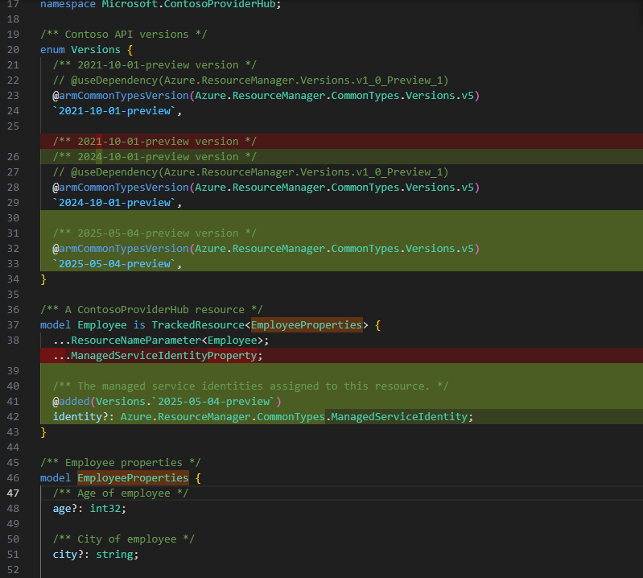

# Plain Agent

## Output

```tsp
/** Contoso API versions */
enum Versions {
  /** 2021-10-01-preview version */
  // @useDependency(Azure.ResourceManager.Versions.v1_0_Preview_1)
  @armCommonTypesVersion(Azure.ResourceManager.CommonTypes.Versions.v5)
  `2021-10-01-preview`,

  /** 2021-10-01-preview version */
  // @useDependency(Azure.ResourceManager.Versions.v1_0_Preview_1)
  @armCommonTypesVersion(Azure.ResourceManager.CommonTypes.Versions.v5)
  `2024-10-01-preview`,

  /** 2025-05-04-preview version */
  // @useDependency(Azure.ResourceManager.Versions.v1_0_Preview_1)
  @armCommonTypesVersion(Azure.ResourceManager.CommonTypes.Versions.v5)
  `2025-05-04-preview`,
}

/** A ContosoProviderHub resource */
model Employee is TrackedResource<EmployeeProperties> {
  ...ResourceNameParameter<Employee>;
  @added(Versions.`2025-05-04-preview`)
  identity? : Azure.ResourceManager.CommonTypes.ManagedServiceIdentity
}
```



## Result

pass

# Agent with Authoring Tool

## Output

```tsp

```

## Result

N/A