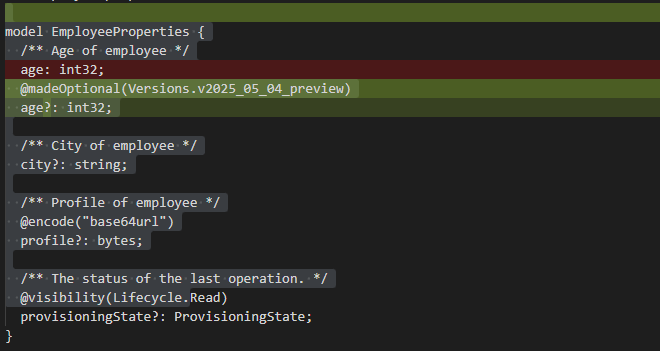

# Plain Agent

## Claude Sonnet 4.5

### Output

```tsp
model EmployeeProperties {
  /** Age of employee */
  age?: int32;

  /** City of employee */
  city?: string;

  /** Profile of employee */
  @encode("base64url")
  profile?: bytes;

  /** The status of the last operation. */
  @visibility(Lifecycle.Read)
  provisioningState?: ProvisioningState;
}

// Make age optional in the new version
@@typeChangedFrom(EmployeeProperties.age, Versions.`2025-05-04-preview`, int32);
```


### Result

fail

## GPT 4.1

### Output

```tsp

model EmployeeProperties {
  /** Age of employee */
  @changedType("2025-05-04-preview")
  age?: int32;

  /** City of employee */
  city?: string;

  /** Profile of employee */
  @encode("base64url")
  profile?: bytes;

  /** The status of the last operation. */
  @visibility(Lifecycle.Read)
  provisioningState?: ProvisioningState;
}


```


### Result

fail

# Agent with Authoring Tool

## Claude Sonnet 4.5

### Output

```tsp
/** Employee properties */
model EmployeeProperties {
  /** Age of employee */
  @madeOptional(Versions.`2025-05-04-preview`)
  age?: int32;

  /** City of employee */
  city?: string;

  /** Profile of employee */
  @encode("base64url")
  profile?: bytes;

  /** The status of the last operation. */
  @visibility(Lifecycle.Read)
  provisioningState?: ProvisioningState;
}
```


### Result (Claude Sonnet 4.5 with Authoring Tool)

pass

## GPT 4.1

### Output

```tsp
/** Employee properties */
model EmployeeProperties {
  /** Age of employee */
  @madeOptional(Versions.`2025-05-04-preview`)
  age?: int32;

  /** City of employee */
  city?: string;

  /** Profile of employee */
  @encode("base64url")
  profile?: bytes;

  /** The status of the last operation. */
  @visibility(Lifecycle.Read)
  provisioningState?: ProvisioningState;
}

```


### Result

pass