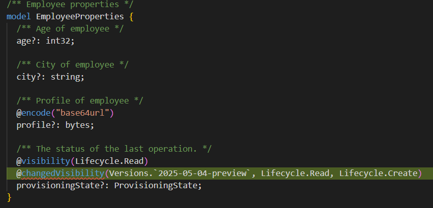
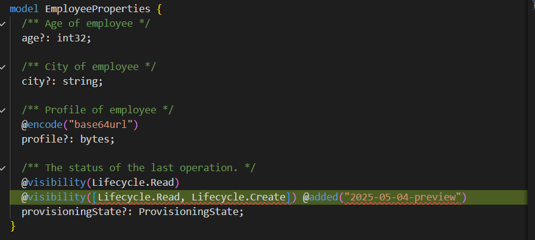
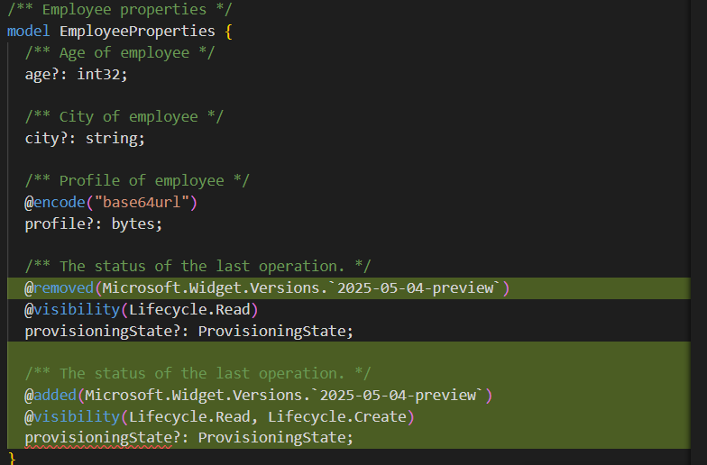
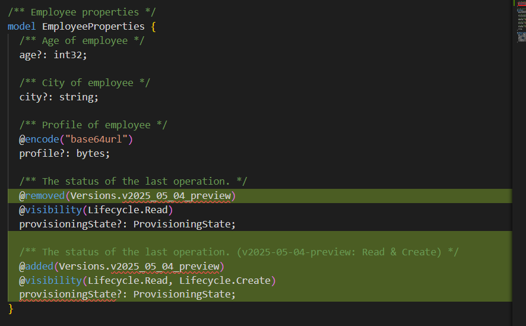

# Plain Agent

## Claude Sonnet 4.5

### Output

```tsp
/** Employee properties */
model EmployeeProperties {
  /** Age of employee */
  age?: int32;

  /** City of employee */
  city?: string;

  /** Profile of employee */
  @encode("base64url")
  profile?: bytes;

  /** The status of the last operation. */
  @visibility(Lifecycle.Read)
  @changedVisibility(
    Versions.`2025-05-04-preview`,
    Lifecycle.Read,
    Lifecycle.Create
  )
  provisioningState?: ProvisioningState;
}

```


### Result

fail

## GPT-4.1

### Output

```tsp
/** Employee properties */
model EmployeeProperties {
  /** Age of employee */
  age?: int32;

  /** City of employee */
  city?: string;

  /** Profile of employee */
  @encode("base64url")
  profile?: bytes;

  /** The status of the last operation. */
  @visibility(Lifecycle.Read)
  @visibility([Lifecycle.Read, Lifecycle.Create])
  @added("2025-05-04-preview")
  provisioningState?: ProvisioningState;
}
```



### Result

fail

# Agent with Authoring Tool

## Claude Sonnet 4.5

### Output

```tsp
/** Employee properties */
model EmployeeProperties {
  /** Age of employee */
  age?: int32;

  /** City of employee */
  city?: string;

  /** Profile of employee */
  @encode("base64url")
  profile?: bytes;

  /** The status of the last operation. */
  @removed(Microsoft.Widget.Versions.`2025-05-04-preview`)
  @visibility(Lifecycle.Read)
  provisioningState?: ProvisioningState;

  /** The status of the last operation. */
  @added(Microsoft.Widget.Versions.`2025-05-04-preview`)
  @visibility(Lifecycle.Read, Lifecycle.Create)
  provisioningState?: ProvisioningState;
}
```



### Result

fail

## GPT 4.1

### Output

```tsp
/** Employee properties */
model EmployeeProperties {
  /** Age of employee */
  age?: int32;

  /** City of employee */
  city?: string;

  /** Profile of employee */
  @encode("base64url")
  profile?: bytes;

  /** The status of the last operation. */
  @removed(Versions.v2025_05_04_preview)
  @visibility(Lifecycle.Read)
  provisioningState?: ProvisioningState;

  /** The status of the last operation. (v2025-05-04-preview: Read & Create) */
  @added(Versions.v2025_05_04_preview)
  @visibility(Lifecycle.Read, Lifecycle.Create)
  provisioningState?: ProvisioningState;
}

```


### Result

fail
