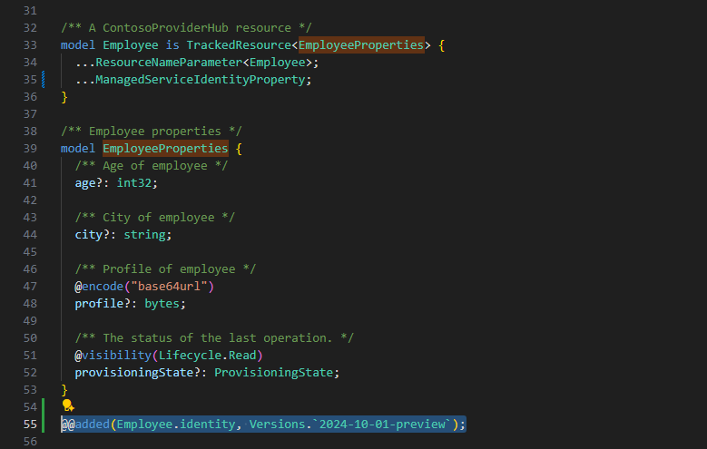

# Prompts

Adding `...Azure.ResourceManager.ManagedServiceIdentityProperty;` would update all my existing API versions and introduce a breaking change. I want is to introduce the property in a new API version 2025-05-04-preview only.

# Output

## Plain Agent Output

### Claude Sonnet 4.5 output

### Expected Output

# Real case reference
How to version a spread property (ManagedServiceIdentityProperty)?